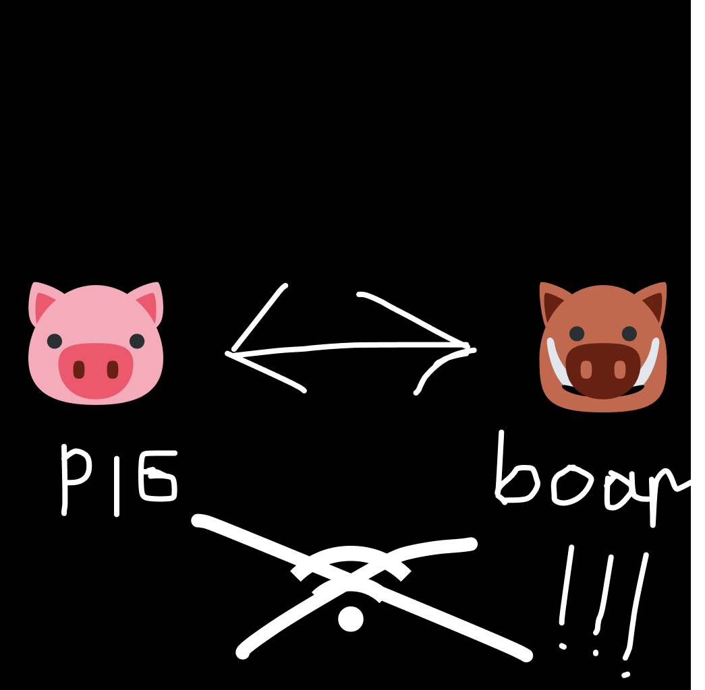

  

<h1 align="center">YellowKnife</h1>

## About

YellowKnife is an in-game offline account switcher for Minecraft, allowing you to quickly switch between accounts without restarting the game. This mod is designed for Fabric and works with Minecraft 1.16.5.

## Features

- Seamless account switching while in-game
- Simple, clean user interface
- Account management (add, switch, delete)
- Profile persistence across game sessions

## License

This project is licensed under the MIT License - see the [LICENSE.txt](LICENSE.txt) file for details.

## Credits

Developed by [femboypig](https://github.com/femboypig)
